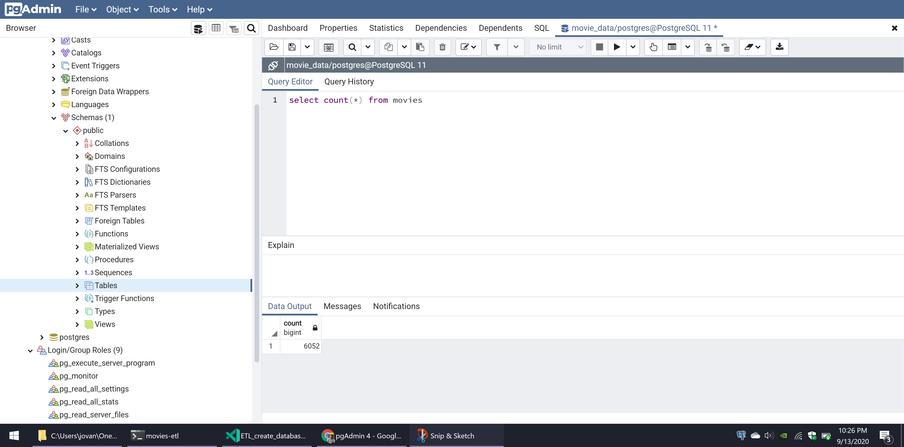
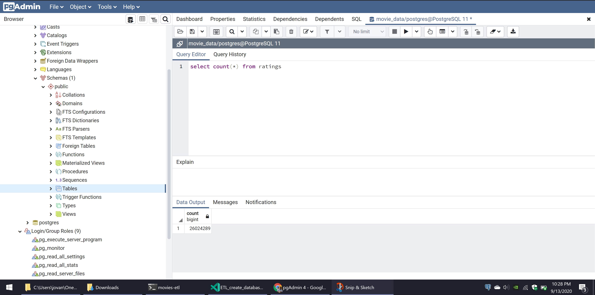
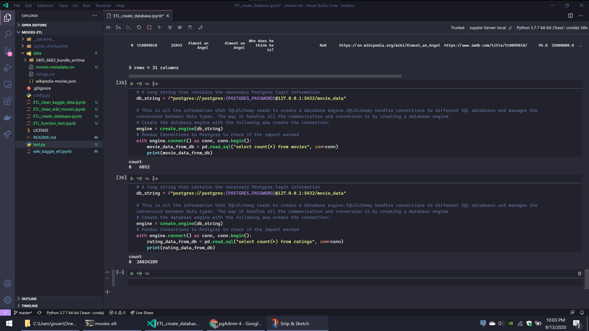

# Movies ETL Archive

This repository preserves a 2020 notebook exercise that explored transforming
Wikipedia movie records, Kaggle movie metadata, and MovieLens ratings for a
PostgreSQL database.

## Project status

This is a **historical learning archive**, not a maintained ETL pipeline or an
authoritative movie database. The five committed notebooks retain Python 3.7.7
kernel metadata and saved outputs, but the repository has no package manifest,
dependency lock, automated data refresh, database migration, or supported
runtime.

Do not execute the notebooks as an unattended pipeline. Some cells construct a
local PostgreSQL connection and replace or append database tables. The required
password is now represented by a `db_password` template variable, but a
user-supplied database could still be mutated. Earlier Git history contained a
literal loopback-database credential; do not reuse historical credentials for
any current system.

## Repository map

| Path | Historical role |
| --- | --- |
| `wiki_kaggle_etl.ipynb` | Exploratory end-to-end transformation notebook with saved outputs |
| `ETL_clean_wiki_movies.ipynb` | Focused Wikipedia record cleaning |
| `ETL_clean_kaggle_data.ipynb` | Focused Kaggle metadata cleaning and merge work |
| `ETL_function_test.ipynb` | Early extraction/transformation function exercise |
| `ETL_create_database.ipynb` | PostgreSQL loading exercise; contains table-replacement and append operations |
| `data/` | Historical third-party snapshots committed with the exercise |
| `resources/` | Screenshots of the historical database and dataframe results |
| `scripts/check_repository.py` | Non-executing structural and credential-template guard |

The two committed movie-metadata CSV files are byte-identical copies. The full
ratings file referenced by notebook cells is intentionally absent; only the
smaller `ratings_small.csv` snapshot is tracked.

## Validate the archive

Run the complete repository gate with Python 3.11 or newer:

```sh
python3 scripts/check_repository.py
```

The dependency-free validator:

- parses every notebook as notebook-format JSON without executing a cell;
- verifies expected notebook and dataset inventory;
- checks the committed CSV schemas and Wikipedia JSON structure;
- confirms the duplicate metadata snapshots remain byte-identical;
- rejects literal PostgreSQL credentials in notebook source; and
- enforces a 50 MiB per-file ceiling so archive growth is reviewed explicitly.

A passing gate proves structural integrity only. It does not prove that the
notebooks run on a modern Python stack, that saved outputs are correct, that a
database load is safe, or that the data may be redistributed.

## Historical outputs







These screenshots are preserved evidence from the original exercise, not
current runtime verification.

## Data rights and provenance

The repository names Wikipedia, Kaggle, and MovieLens as historical inputs but
does not contain sufficient per-file license, retrieval-date, or transformation
lineage for production or redistribution use. Access to a source is not
permission to collect, persist, transform, model, or republish its data.

Before reusing a snapshot, identify the exact upstream dataset and version,
confirm its current terms, document the permitted purpose, and independently
validate the data. Do not add live downloads or scraping to the structural
validation workflow.

## License

Repository-authored material is available under the [MIT License](LICENSE).
That license does not grant rights to the committed third-party datasets.
